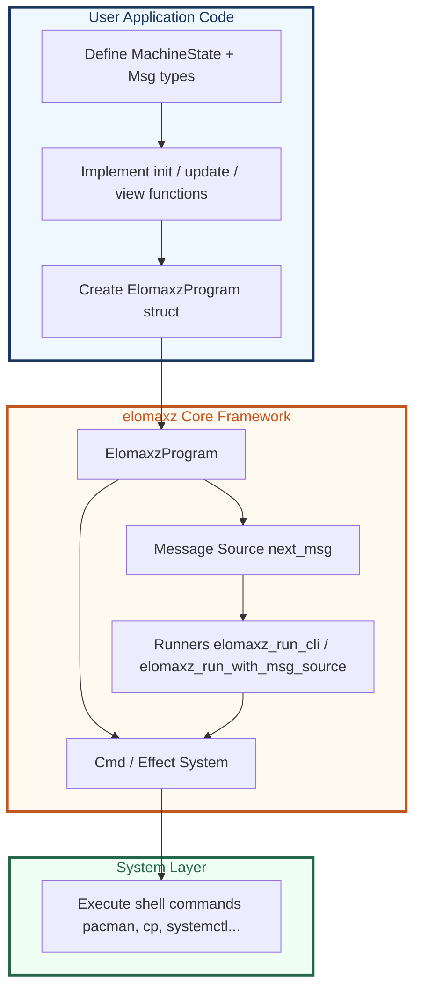

# elomaxz — Hybrid Functional MVU Framework for C

<p align="center">
  
</p>

**elomaxz** (Elm + Maximum) is a thin, powerful hybrid MVU framework for C.

- Core: Explicit Tagged Message + Pure Update
- Strong Cmd / Effect System (Functional Core + Imperative Shell)
- Foundation for Actor-style Composition



## Quick Start

```bash
make
./bin/counter
```

Or run directly:

```bash
make run
```

Build output goes to `bin/`.

## Key Files

- `include/elomaxz.h` — Main header
- `src/elomaxz.c` — Implementation
- `examples/counter/main.c` — Working demo
- `Cheat_Sheet_elomaxz.md` — Quick reference

See `legacy/elm-c/` for the original starting point.

---

*From simple elm-c → powerful hybrid elomaxz*
