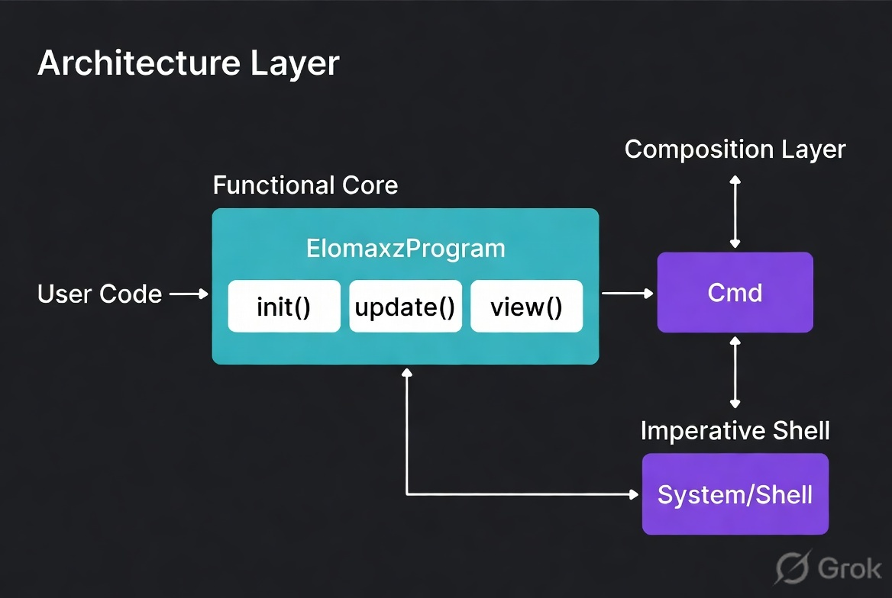

# elomaxz Architecture Proposal: Hybrid Core + Specialized Modes

**New Name**: `elomaxz` (Elm + Max + Flexible = Maximum Elm power in C)

**Core Philosophy**:
> "One thin, powerful core that naturally supports all three major functional patterns, with specialized runners for different use cases."

---

## Why a Hybrid Makes Sense

| Pattern                        | Strength                          | Weakness in Pure Form          | How Hybrid Fixes It |
|--------------------------------|-----------------------------------|--------------------------------|---------------------|
| Functional Core + Imperative Shell | Best testability & separation    | Can feel disconnected          | Strong Cmd system   |
| Actor Model                    | Excellent concurrency            | More complex to set up         | Message Bus + Composition |
| Explicit Tagged Msg + Pure Update | Simplest & most predictable     | Limited for very large systems | Base of everything  |

**Our Goal**: Make the **core** excellent at all three, while offering clean specialized paths.

---

## Proposed Architecture (Hybrid Core)

<p align="center">
  
</p>

---

## High-Level Code Flow for Each Mode

### Mode 1: Simple & Predictable (Current Style)
Best for: CLI tools, small utilities, learning

```c
ElmProgram prog = {
    .init = ..., .update = ..., .view = ...,
    .msg_name = ..., .free_* = ...
};

elm_run_cli(&prog);           // or elm_run_with_msg_source()
```

### Mode 2: Functional Core + Imperative Shell (Recommended Default)
Best for: Most serious applications

```c
ElmProgram prog = { ... };

Cmd cmds[16];
size_t n = 0;
Model new_model = prog.update(current, msg, cmds, &n);

// Side effects happen here (in shell)
execute_effects(cmds, n);
```

### Mode 3: Actor Model (For Concurrency)
Best for: Games, servers, high-performance systems

```c
ElmProgram ui_actor     = { ... };
ElmProgram network_actor = { ... };
ElmProgram db_actor      = { ... };

// Actors communicate via message bus
message_bus_send(&ui_actor, MSG_USER_CLICKED);
message_bus_send(&db_actor, MSG_SAVE_DATA);
```

---

## My Recommendation

**Yes — Hybrid is the right direction.**

### Suggested Priorities for elomaxz:

**Phase 1 (Now)**: Strengthen the **Core + Cmd System**
- Make `Cmd` first-class and powerful
- Add effect handler registration
- Keep the current `ElmProgram` clean

**Phase 2**: Add **Composition Layer**
- Support multiple `ElmProgram` instances
- Simple message bus between them
- Parent-child relationships (like nested Elm apps)

**Phase 3**: Provide **Specialized Runners**
- `elm_run_actor()`
- `elm_run_with_effects()` (heavy Cmd support)
- `elm_run_pipeline()` (for data processing)

---

## Benefits of This Hybrid Approach

- **Thin core** remains small and understandable
- **Maximum flexibility** — users choose the complexity they need
- **Progressive disclosure** — start simple, scale when needed
- **Future-proof** — easy to add new runners later
- **Matches real-world usage** in large C systems

