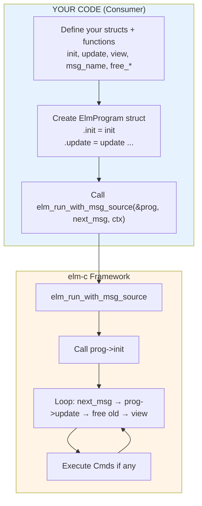

# C Refresher Cheat Sheet for elm-c v0.2

**Goal**: Understand `ElmProgram` (the "interface") + pointers + memory so you can confidently write utilities.

---

## 1. Mental Model

C has **no classes, no interfaces**. We fake them using:

- `struct` = data container
- `typedef` = give nice names
- **Function pointers inside a struct** = "interface" / vtable

**`ElmProgram` is exactly this pattern** — a struct full of function pointers that you fill in.

```c
typedef struct {
    Model (*init)(void);
    Model (*update)(Model, Msg, Cmd*, size_t*);
    void  (*view)(Model);
    // ... free functions + debug hooks
} ElmProgram;
```

You create **one instance** in your code and plug in *your* functions.

---

## Visual Architecture Diagram

### How Everything Connects (ASCII)

```
┌─────────────────────────────────────────────────────────────────────┐
│                        YOUR CONSUMER CODE                           │
│  (examples/counter/main.c, your utility, ML trainer, etc.)          │
├─────────────────────────────────────────────────────────────────────┤
│                                                                     │
│  typedef struct { int count; } CounterModel;   ← Your real data     │
│                                                                     │
│  Model  init(void)        { ... return (Model)malloc...; }          │
│  Model  update(...)       { ... }                                   │
│  void   view(Model)       { printf("Count: %d\n", ...); }           │
│  const char* msg_name(Msg){ return "INC"; }                         │
│  void   free_model(Model) { free(m); }                              │
│                                                                     │
│  ElmProgram prog = {                                                │
│      .init       = init,        ← Plug your functions here          │
│      .update     = update,                                          │
│      .view       = view,                                            │
│      .msg_name   = msg_name,                                        │
│      .free_model = free_model,                                      │
│      .debug      = false                                            │
│  };                                                                 │
│                                                                     │
│  elm_run_with_msg_source(&prog, next_msg_from_stdin, NULL);         │
│                                                                     │
└─────────────────────────────────────────────────────────────────────┘
                                  │
                                  ▼
┌─────────────────────────────────────────────────────────────────────┐
│                         elm-c FRAMEWORK                             │
│                    (include/elm_c.h + src/elm_c.c)                  │
├─────────────────────────────────────────────────────────────────────┤
│                                                                     │
│   elm_run_with_msg_source(prog, next_msg, user_data)                │
│                                                                     │
│   Model model = prog->init();                                       │
│                                                                     │
│   while (true) {                                                    │
│       Msg msg = next_msg(user_data);     ← You control this source  │
│       if (!msg) break;                                              │
│                                                                     │
│       Cmd cmds[32]; size_t n = 0;                                   │
│       Model new_m = prog->update(model, msg, cmds, &n);             │
│                                                                     │
│       if (prog->debug) { log using prog->msg_name(msg) }            │
│                                                                     │
│       prog->free_model(model);                                      │
│       model = new_m;                                                │
│                                                                     │
│       elm_execute_cmds(prog, cmds, n);   ← Side effects happen here │
│       prog->free_msg(msg);                                          │
│       prog->view(model);                                            │
│   }                                                                 │
│                                                                     │
└─────────────────────────────────────────────────────────────────────┘
```

### Mermaid Version



---

## 2. Pointers — The #1 Confusion

| Code                    | Meaning                                      | When to Use |
|-------------------------|----------------------------------------------|-------------|
| `int x = 5;`            | Value                                        | Normal variables |
| `int *p = &x;`          | `p` holds **address** of `x`                 | When you need to modify original |
| `*p = 10;`              | Go to address and change value               | Dereference |
| `struct S *s;`          | Pointer to struct                            | Almost always with dynamic memory |
| `s->field`              | Access field through pointer (`(*s).field`)  | 99% of the time in elm-c |
| `(CounterModel*)ptr`    | Cast `void*` back to your struct             | Every `update()` and `view()` |

**Golden Rule**:  
`Model`, `Msg`, `Cmd` = `void*` (opaque). You cast to your real type when you need the fields.

---

## 3. Structs & typedef

```c
// Define your real data
typedef struct {
    int count;
    char* name;
} CounterModel;

// Opaque types in elm-c (already in header)
typedef void* Model;
typedef void* Msg;
typedef void* Cmd;
```

**You never use `struct` keyword directly in elm-c consumer code** — you use your named typedef.

---

## 4. Function Pointers (The Magic)

```c
// This is a variable that can hold a function
Model (*my_init)(void);

// In ElmProgram we store many of them
ElmProgram prog = {
    .init   = my_init,      // just the name, no ()
    .update = my_update,
    .view   = my_view
};
```

**Rule**: When assigning, use the **function name only** (no parentheses).

---

## 5. The `ElmProgram` Pattern (Your "Interface")

```c
// 1. Define your data + functions
typedef struct { int count; } CounterModel;

Model  init(void)        { ... return (Model)malloc...; }
Model  update(Model current, Msg msg, Cmd* cmds, size_t* n) { ... }
void   view(Model m)     { ... }
const char* msg_name(Msg m) { ... }
void   free_model(Model m) { free(m); }
// ... other frees

// 2. Create ONE instance and plug everything in
ElmProgram prog = {
    .init       = init,
    .update     = update,
    .view       = view,
    .msg_name   = msg_name,
    .free_model = free_model,
    .free_msg   = free_msg,
    .free_cmd   = free_cmd,
    .debug      = false          // turn on for logs
};

// 3. Give it to the framework
elm_run_with_msg_source(&prog, my_next_msg_source, NULL);
```

This is **dependency injection** in C.

---

## 6. Memory Rules (Most Important for elm-c)

| Who Allocates          | Who Frees                  | Rule |
|------------------------|----------------------------|------|
| `init()`               | Framework calls `free_model` | You `malloc` in `init` |
| `update()` (new model) | Framework calls `free_model` on old one | Always return a **new** allocation (or same if you mutate carefully) |
| `parse` / `next_msg`   | Framework calls `free_msg` | You `malloc` the `Msg` |
| `Cmd`s                 | Framework calls `free_cmd` | You decide what a `Cmd` is |

**Never** `free` inside `update` or `view`. Let the framework do it.

---

## 7. Common elm-c Patterns

### Casting Pattern (You Will Write This 100 Times)
```c
CounterModel* m = (CounterModel*)current;   // in update/view
// use m->count
return (Model)new_counter_model;            // when returning
```

### Returning Cmds from update
```c
Cmd cmds[8] = {0};
size_t n = 0;

if (need_side_effect) {
    cmds[0] = make_my_cmd(...);
    n = 1;
}
return new_model;
```

### Debug Mode (Extremely Useful)
```c
ElmProgram prog = { ..., .debug = true };
```
Then every transition prints the `msg_name`.

---

## 8. Syntax You Always Forget

| What You Want                    | Correct Code                              |
|----------------------------------|-------------------------------------------|
| Pointer to struct field          | `m->count`                                |
| Address of variable              | `&variable`                               |
| Cast void* to your type          | `(CounterModel*)ptr`                      |
| Return opaque pointer            | `return (Model)my_struct_ptr;`            |
| Assign function to field         | `.init = my_function` (no `()`)           |
| Declare function pointer         | `Model (*fn)(void);`                      |
| Pass struct to function          | `elm_run_...(&prog, ...)`                 |
| Free memory                      | `free(ptr);` (never `delete`)             |

---

## 9. Quick Debugging Checklist

- **Crash on `->`** → You forgot to cast `void*` to your struct
- **Memory leak** → You are not returning a new allocation from `update`, or `free_*` functions are wrong
- **No output** → `view()` is not being called or `printf` is missing `\n` + `fflush`
- **Weird values** → You mutated the old model instead of creating a new one
- **Want to see everything** → Set `.debug = true` + implement `msg_name` and `debug_model`

---

## 10. One-Sentence Summary

> **"I define my data + 6–8 functions → put their addresses into one `ElmProgram` struct → hand it to the runner. The framework owns the loop and memory, I own the logic."**


*Made for you by Grok — May 2026*